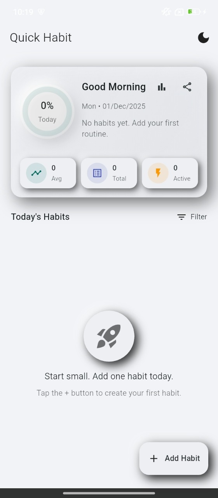
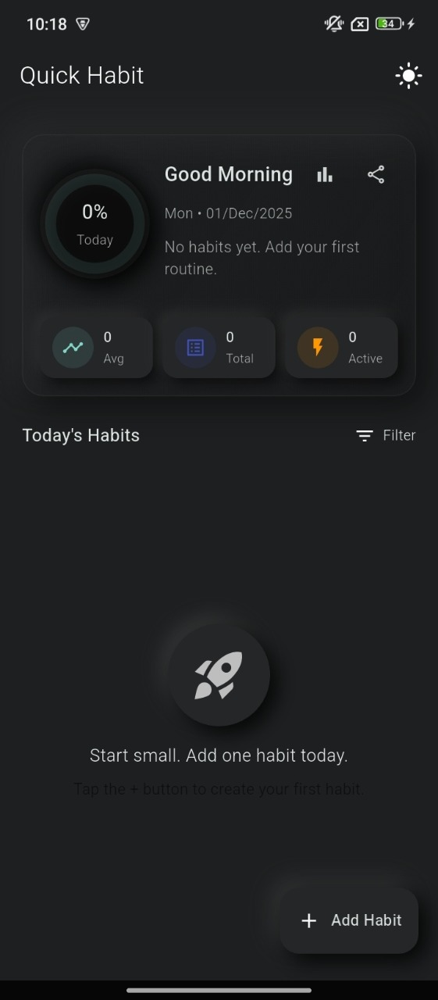
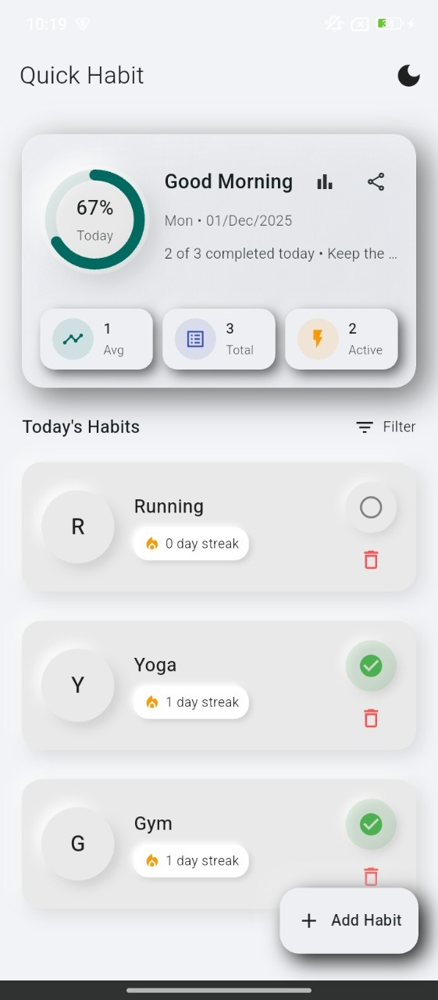
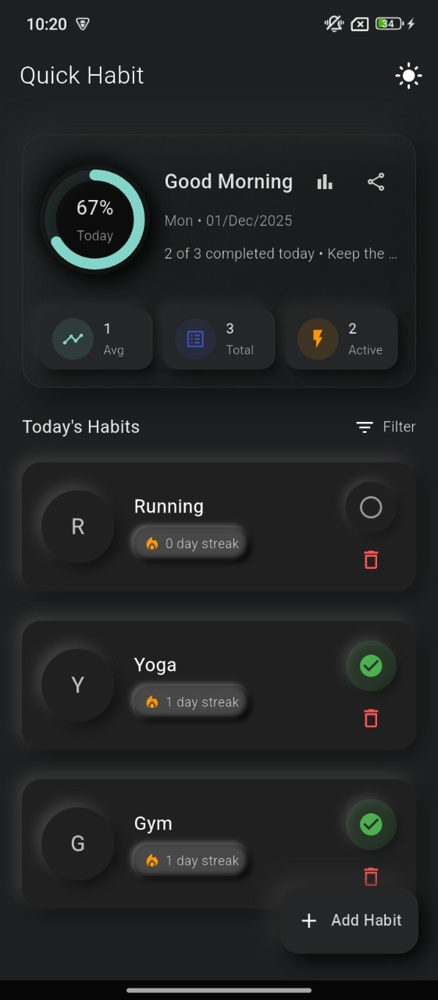

# 📆 Quick Habit Tracker

A clean and modern **Habit Tracking App** built with **Flutter** that helps users build better routines and stay consistent with their daily habits.

The app focuses on simplicity, smooth animations, and a beautiful neumorphic UI experience.

## ✨ Features

- ✅ Create and manage daily habits
- 📊 Track daily progress with percentage indicator
- 🔁 Toggle habits as done / undone
- 🌗 Light & Dark theme support
- 🎨 Neumorphic UI design
- 📅 Friendly date & greeting messages
- ⚡ Smooth animations & transitions
- 🧠 Clean state management using Provider

